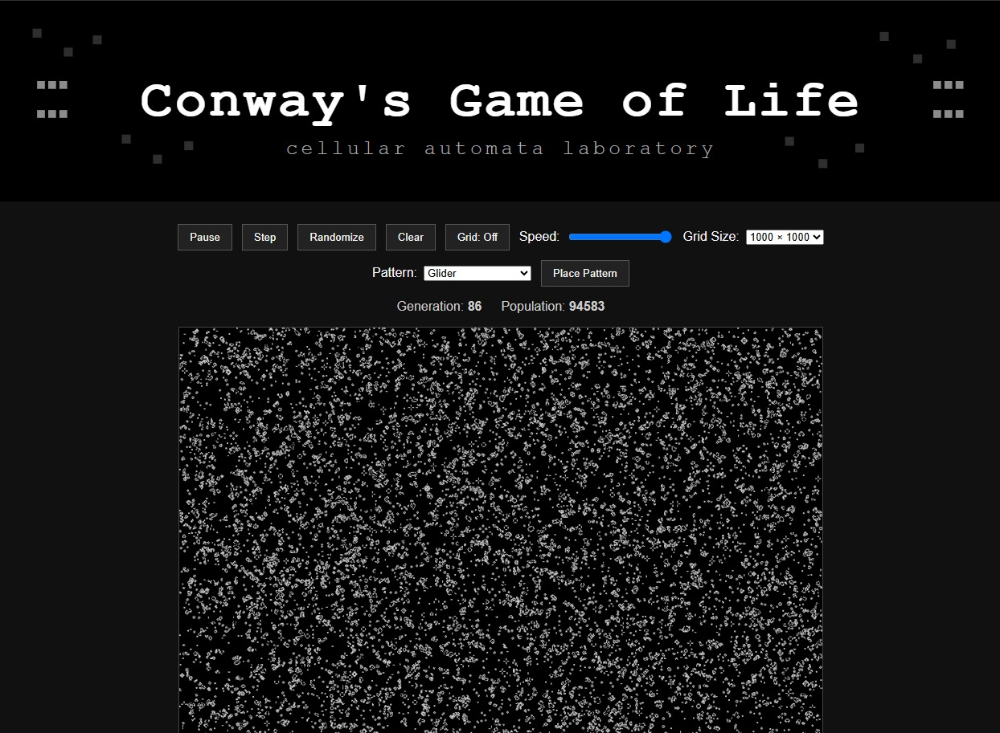

# Conway's Game of Life

A browser-based recreation of **Conway's Game of Life** using HTML, CSS, JavaScript, and the Canvas API.

The project started as a clean implementation of the classic cellular automaton and is intended to become the foundation for a future game built around evolving grid-based systems.

## Live Demo

Add your GitHub Pages link here:

https://luisfim.github.io/YOUR-REPOSITORY-NAME/

## Preview

Features
Interactive HTML Canvas simulation
Play and pause controls
Step-by-step generation control
Random world generation
Clear/reset button
Adjustable simulation speed
Grid visibility toggle
Multiple grid sizes
Left-click and drag to add cells
Right-click and drag to remove cells
History page about Conway's Game of Life
Pixel-inspired visual identity
How It Works

The simulation uses a two-dimensional grid of cells.

Each cell can be either:

alive
dead

Every generation, each cell checks its eight neighboring cells and follows Conway's four classic rules:

A live cell with fewer than two live neighbors dies.
A live cell with two or three live neighbors survives.
A live cell with more than three live neighbors dies.
A dead cell with exactly three live neighbors becomes alive.

The project uses two arrays:

one for the current generation
one for the next generation

After calculating the next state, the arrays are swapped.

Technologies Used
HTML
CSS
JavaScript
Canvas API
GitHub Pages
Project Goals

This project is part of my programming portfolio.

The goals are:

practice JavaScript and Canvas rendering
understand cellular automata
build a clean interactive simulation
create a foundation for a future game mechanic
document the project clearly on GitHub
Future Ideas
Pattern presets
Import/export patterns
Zoom and pan
ImageData rendering optimization
WebGL version
Game mode with objectives
Infection/corruption mechanics
Puzzle mode
Survival mode
Author

Created by Luis Fim.
